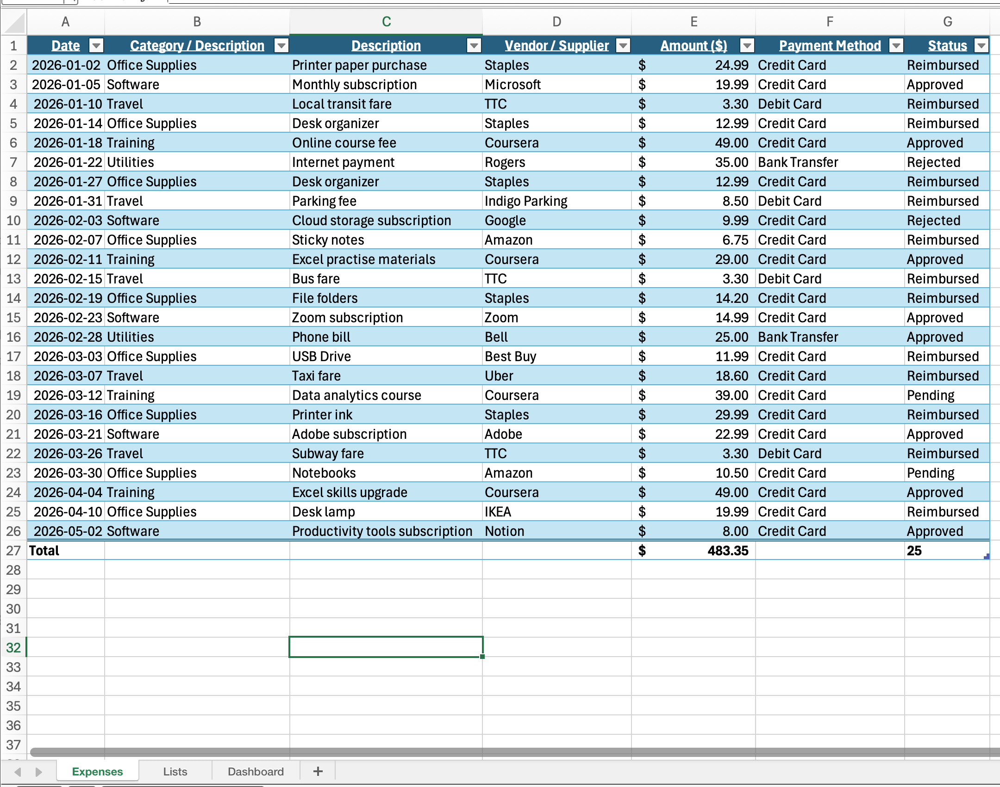
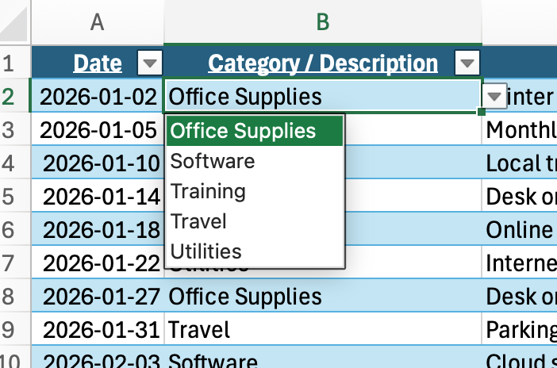
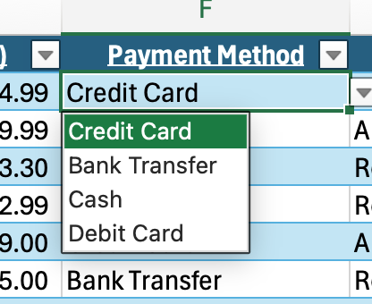
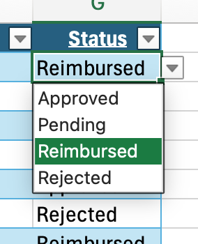
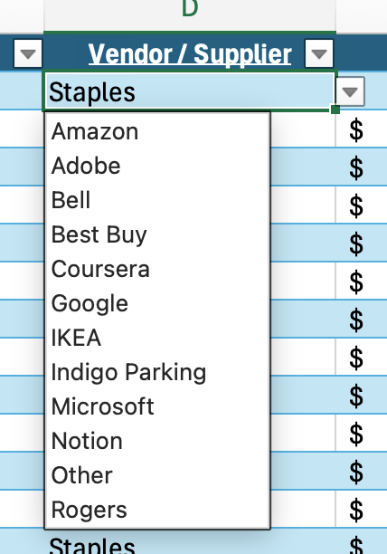
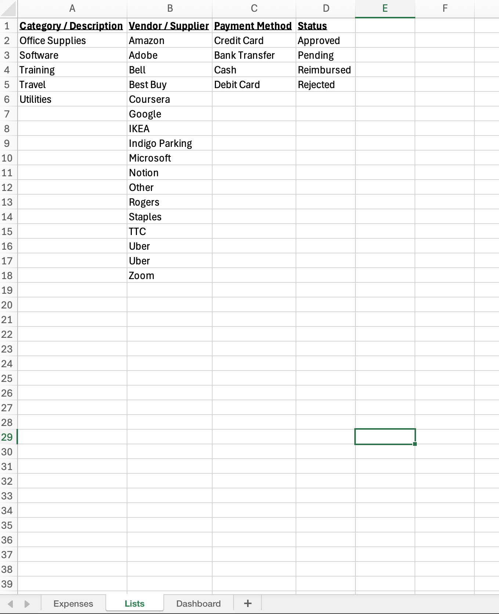
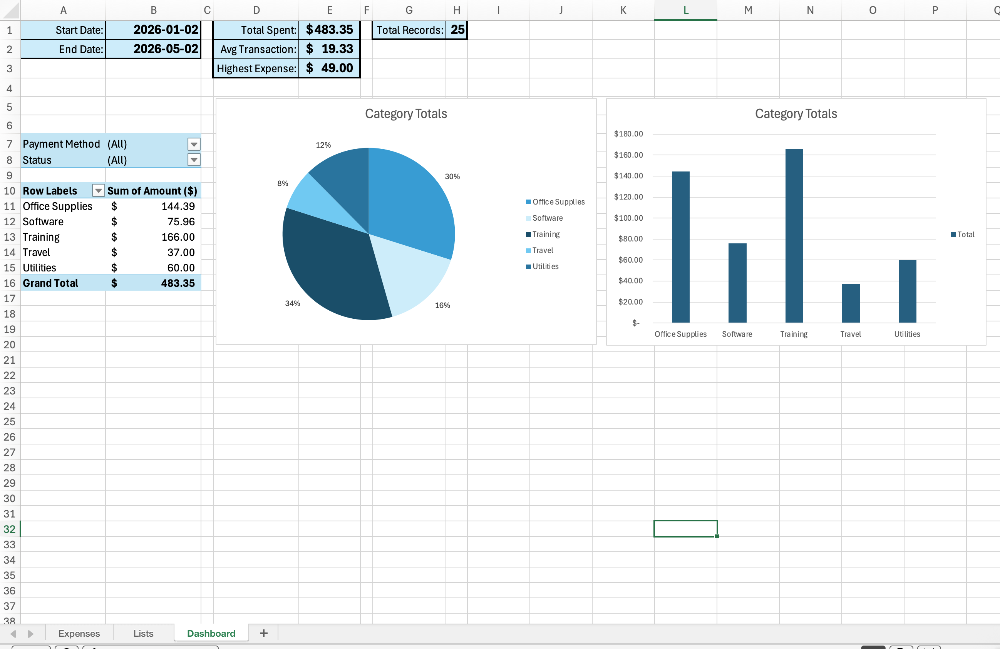
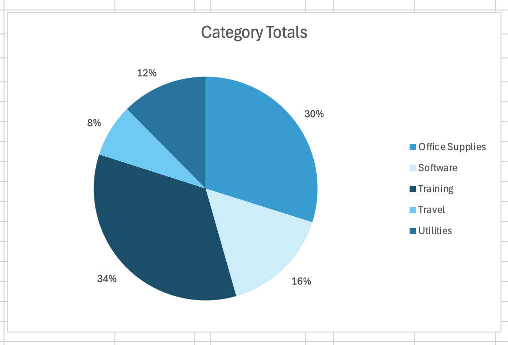
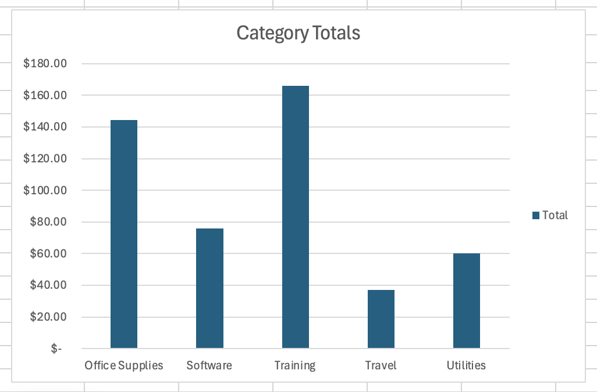
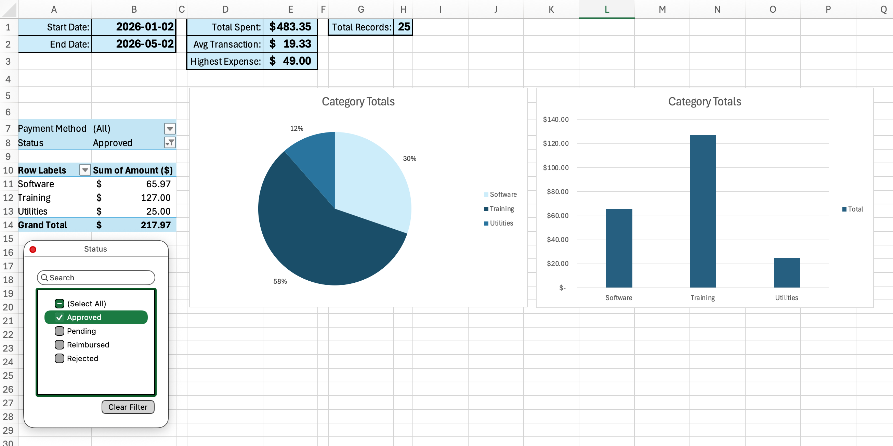

# Expense Tracker & Reporting Dashboard (Excel)

An Excel-based expense tracking and reporting dashboard designed to support accurate data entry, categorisation, and financial reporting using structured tables, Pivot Tables, and charts.

---

## 📊 Dashboard Features

- Structured expense tracking table
- Dropdown-based data validation
- Pivot Table reporting
- KPI summary metrics
- Pie and bar chart visualisations
- Spending trend analysis

---

## 🧰 Tools Used

- Microsoft Excel
- Pivot Tables
- Charts
- Data Validation
- Structured Tables

---

## 📷 Dashboard Preview

### Expenses Sheet

#### Data Entry Dropdown Selections

##### Category

##### Payment

##### Status

##### Vendor

### List Sheet with Categories and Contents

### Dashboard Overview

### Pie Chart

### Bar Chart

### Approved Purchases

---

## 🎯 Skills Demonstrated

- Data entry and accuracy
- Reporting and analysis
- Spreadsheet organisation
- Dashboard presentation
- Administrative reporting workflows

---

## 🔗 Project Files

Download and review the Excel project files here:

https://github.com/mannrj/excel-expense-tracker-dashboard

Select the green **<> CODE** button then **Download ZIP**.
